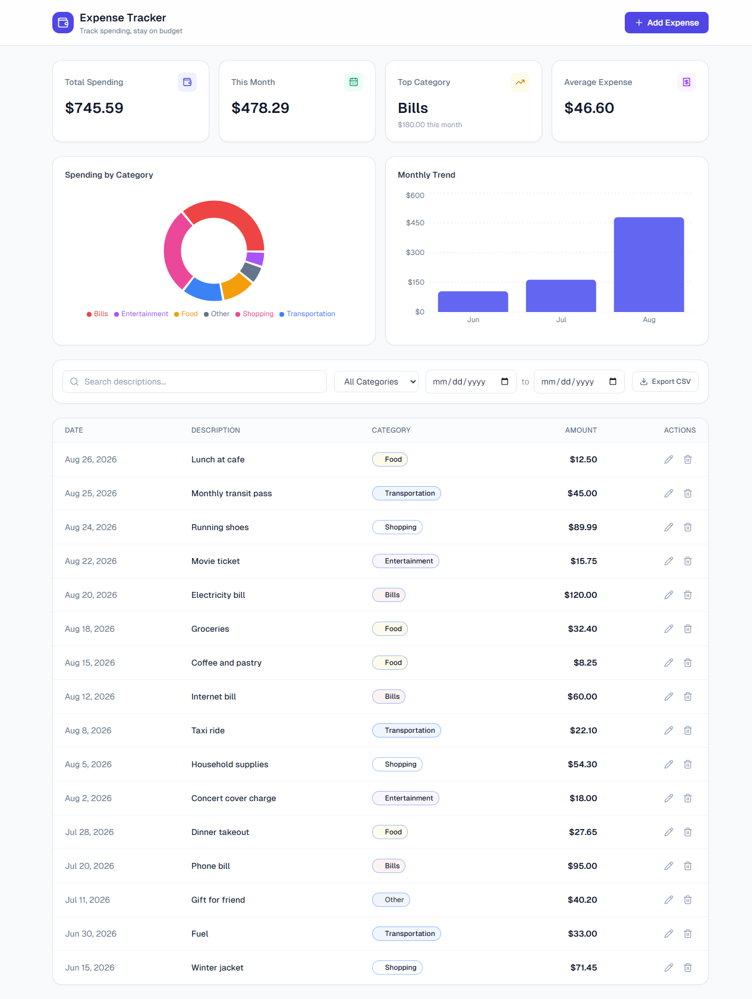
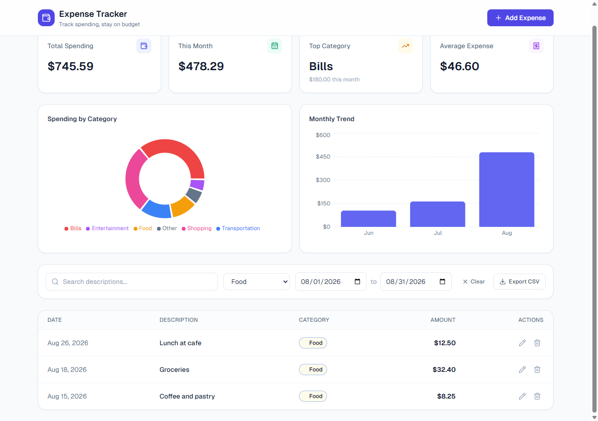
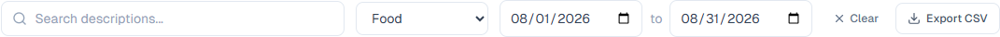
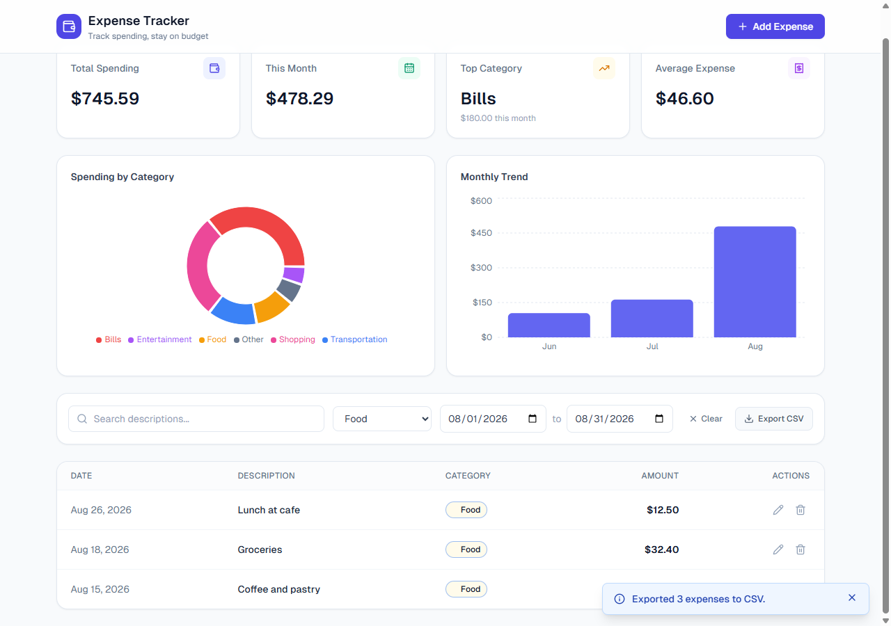
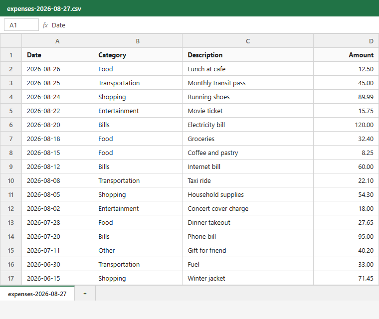

# CSV Export - User Guide

## What This Does
CSV Export saves your expenses to a spreadsheet file (`.csv`) that you can open in
Excel, Google Sheets, Numbers, or any spreadsheet app. The file includes the date,
category, description, and amount for each expense.

Whatever filters you have applied to the list — a search term, a category, or a
date range — the export contains **exactly the expenses you currently see**. If you
want everything, clear your filters first.

Nothing is uploaded anywhere. The file is created on your computer and downloaded
straight to your browser's downloads folder.

## Step-by-Step Instructions

1. Open the expense tracker. Your expenses appear in the list, with the filter bar
   above it.

   

2. (Optional) Narrow down what you want to export using the search box, the
   category dropdown, or the start/end date fields. The list updates to show only
   the expenses that match.

   

3. Click the **Export CSV** button on the right side of the filter bar.

   

4. Your browser downloads a file named `expenses-YYYY-MM-DD.csv` (the date is
   today's date). A confirmation message appears briefly in the corner: "Exported
   N expenses to CSV."

   

5. Open the downloaded file in your spreadsheet app. It has four columns: **Date**,
   **Category**, **Description**, **Amount**.

   

## Tips
- **Export everything:** click **Clear** in the filter bar to remove all filters
  before exporting.
- **The button is greyed out?** That means no expenses match your current filters,
  so there is nothing to export. Adjust or clear the filters.
- **Amounts have no currency symbol** in the file (e.g. `12.50`), which keeps them
  usable as numbers in spreadsheet formulas.

## A note on opening the file
If a description in your data begins with `=`, `+`, `-`, or `@`, some spreadsheet
programs may treat it as a formula. Only open exported files from data you trust.

## Related Guides
- Technical details: [Technical Spec](../technical/csv-export-spec.md)
- See also: [`code-analysis.md`](../../code-analysis.md) (repo root) — background on
  how this export compares to the experimental multi-format and cloud-export
  versions.
